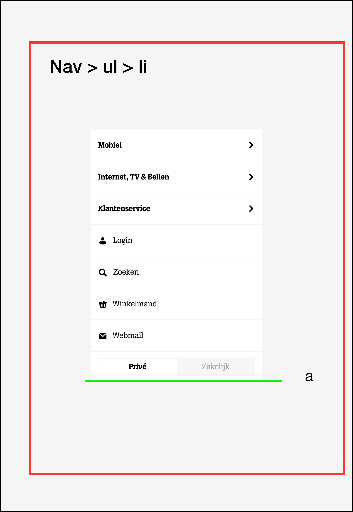
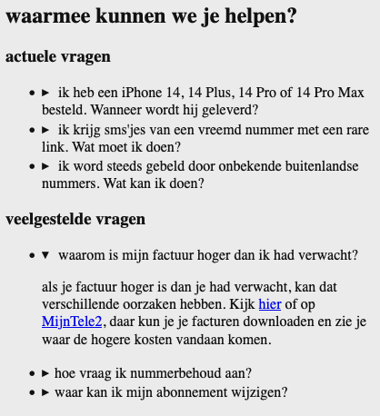

# Procesverslag

Markdown is een simpele manier om HTML te schrijven.  
Markdown cheat cheet: [Hulp bij het schrijven van Markdown](https://github.com/adam-p/markdown-here/wiki/Markdown-Cheatsheet).

Nb. De standaardstructuur en de spartaanse opmaak van de README.md zijn helemaal prima. Het gaat om de inhoud van je procesverslag. Besteedt de tijd voor pracht en praal aan je website.

Nb. Door _open_ toe te voegen aan een _details_ element kun je deze standaard open zetten. Fijn om dat steeds voor de relevante stuk(ken) te doen.

## Jij

  
uitwerken voor kick-off werkgroep

### Auteur:

Randy Dalgliesh

#### Je startniveau:

Rood

#### Je focus:

Responsive

## Je website

  
uitwerken voor kick-off werkgroep

### Je opdracht:

Website van telecom provider Tele2:

- https://www.tele2.nl/
- https://www.tele2.nl/klantenservice

  <!-- link naar de website die je gaat namaken óf de naam/omschrijving van je eigen ontwerp -->

#### Screenshot(s) van de eerste & tweede pagina (small screen):

  <!--  -->
  <!--   -->
  <!--   -->

| Home pagina                                                                                  | Klantenservicepagina                                                                         |
| :------------------------------------------------------------------------------------------- | :------------------------------------------------------------------------------------------- |
|  |  |

## Toegankelijkheidstest 1/2 (week 1)

  
uitwerken na test in 1e werkgroep

  
  
  
  

### Bevindingen

Lijst met je bevindingen die in de test naar voren kwamen:

#### Screenreader

Hier korte omschrijving (met indien nodig afbeeldingen)

Om nuttig gebruik te kunnen maken van de screenreader op macOS, wordt er eigenlijk best wel veel gevraagd om begrijpen. Zo stond hij standaard bij mij ingesteld om alleen links te lezen op pagina’s en dacht ik tot ik hulp kreeg dat de andere teksten op mijn site niet toegankelijk waren. Ook was mijn voice assistent een snel Engels sprekende man, dit was niet bepaald handig voor mijn site (voornamelijk NL content). Ik heb hiervoor een NL assistent Alex voor gedownload.

#### Cheatsheet

- Screenreader in- of uitschakelen op macOS: cmd + F5
- Instellingen: System Preferences → Accessibility → VoiceOver
- Keyboard help: ctrl + opt + k
- Voice veranderen: cmd + shift + k + arrow up/down
- VoiceOver rotor: ctrl + alt+ cmd + left/right arrow

  
 
 
 VoiceOver rotor
 
 De content op de Tele2 site is vrij toegankelijk. Afbeeldingen worden goed omschreven en lijsten worden netjes afgegaan. Alles leek goed te zijn tot het Stein en ik opviel dat de kopjes op de site werden overgeslagen. We namen een kijkje met de VoiceOver rotor en zagen dat inderdaad de optie headings niet beschikbaar was voor de site. Dit is ook het stukje toegankelijkheid wat ik wil verbeteren in mijn versie van de site.

#### Muis en Toetsenbord

De site is goed navigeerbaar via de tab er wordt geen content overgeslagen.
Opvallend is wel bij het tabben in de main nav een verborgen menu wordt getoond. Ik zou als toevoeging dit ook voor het zoekveld kunnen implementeren.

#### Motoriek (shocks, elastiekjes)

Hier korte omschrijving (met indien nodig afbeeldingen)

Met het parkinson simulatie apparaat is het menu moeilijk te navigeren laat staan het submenu. Ik denk dat dit niet zo zeer aan de site ligt maar meer aan de beperking. Buttons op de site zijn wel redelijk groot waardoor het iets minder moeite kost om deze te klikken. De grote geldt ook voor andere prominente elementen op de pagina.

Met de ballonen test was het, Navigatie is wel te doen maar, de lopende tekst is moeilijk te lezen.

#### Visueel (brillen, contrast, kleurenblind, dark/light).

#### Brillen

Met de brillen was vrij lastig. Met sommige brillen kon je maar een gedeelte van de site zien en moest je met je hoofd draaien om het resterende gedeelte te zien. Met andere brillen werd het zicht zo wazig waardoor je de lopende tekst niet meer kon lezen.

#### Kleur

Hover kleuren zijn vaak lastig te zien op buttons.

Monochromosy

Contrast is soms moeilijk te zien bij hover state. Bij sommige knoppen vult de knop op en dit is voor mensen die kleurenblind zijn wel goed te zien

Op de site (https://www.spoorwegmuseum.nl/) van Stein wordt zijn de hover kleuren ook best subtiel maar maken ze handig gebruik van een animatie waardoor iemand die kleurenblind toch goed de state kan herkennen.

## Breakdownschets (week 3)

  
uitwerken na afloop 2e werkgroep

### de hele pagina:

| Home pagina                                                                   | Klantenservicepagina                                                                              |
| :---------------------------------------------------------------------------- | :------------------------------------------------------------------------------------------------ |
|  |  |

### dynamisch deel (bijv menu):

**Menu**

  

  <!--
### wellicht nog een dynamisch deel (bijv filter):

  

-->

## Voortgang 1 (week 2)

  
uitwerken voor 1e voortgang

### Stand van zaken

De oefenopdrachten helpen enorm. Via codepen kan ik snel en veilig experimenteren en een concept begrijpen. Vooral flexbox begin ik beter door te krijgen. Wat ik op dit moment vrij lastig vindt is een breakdown maken van mijn site. Ik blijf het lastig vinden welke elementen juist zijn om een bepaalde structuur op te zetten.

### Agenda voor meeting

samen met je groepje opstellen

| Arsen                                                                                                              | Randy                                     | Josette                                                           | Tim                                                                 |
| ------------------------------------------------------------------------------------------------------------------ | ----------------------------------------- | ----------------------------------------------------------------- | ------------------------------------------------------------------- |
| Semantiek → klopt het dat bepaalde elementen onder secties vallen → zie schetsen.                                  | Hoe pak je het maken van een submenu aan? | Kloppen mijn breakdown schetsen?                                  | Mag je bij onderstreepte woord een `<u>` element gebruiken?         |
| In welke mate en op watvoor manier is het van belang dat wij rekening houden met toegankelijkheid voor gebruikers? | Wanneer is iets een section?              | De website veranderd af en toe, welke versie moet ik dan namaken? | Mag je bij schuingedrukt woord een `<em>`, `<i>` element gebruiken? |

### Verslag van meeting

- Tekst in de `<title>` Consistent houden of eerst de pagina titel en dan de naam of andersom maar dit wel overal hetzelfde.

**Navigatie**

- Elementen die buiten het hamburgermenu blijven staan, maar wel bij de navigatie horen, krijgen hun eigen navigatie. Zo kan je het ene menu verbergen onder een button en de ander niet.

**Titels**

- H1 kan op de startpagina ook een logo zijn of verborgen omdat er gewoon geen h1 is. Op de andere pagina’s is meestal wel een duidelijke h1.
- H1 is belangrijk voor google resultaten.
- H2 moet altijd voor de h3 etc. In de CSS kan de volgorde worden aangepast.

**Img**

- Als img als decoratie wordt gebruikt moet de alt worden leeg gelaten of de afbeelding moet via css worden ingevoegd.

**Links/buttons**

- Links gaan naar andere pagina.
- Buttons blijven op dezelfde pagina, voeren een actie uit. Bijv. hamburger menu in- en uitvouwen is een button.
- Veel website laten links zien als buttons.
- Onderscheid is belangrijk voor screenreaders. Zo kan je deze alle linkjes of alle formulieren laten afgaan, maar dan moet wel duidelijk zijn wat wat is.

**Talen**

- Engelse woorden (of van andere talen) op een Nederlandse site, kun je voorzien van een span en een lang attribute.

## Voortgang 2 (week 3)

  
uitwerken voor 2e voortgang

### Stand van zaken

Hoewel ik wat verder had willen zijn dan waar ik nu ben, ben ik tevreden met mijn voortgang t.o.v. vorige week. De meeste content van mijn twee pagina zijn verwerkt. De voor mij wat lastige html onderdelen (FAQ gedeelte van mijn site) die zitten nu ook op hun plek. Het was even een uitdaging om erachter te komen hoe ik dit semantisch moest aanpakken. Uiteindelijk heb ik hulp van de docent gekregen om dit op te lossen. Ik kan me nu veel meer gaan richten op het stijlen.
  

<caption>FAQ gedeelte van mijn website</caption>
  

### Agenda voor meeting

samen met je groepje opstellen

| Arsen | Randy                                                                                                                  | Josette | Tim |
| ----- | ---------------------------------------------------------------------------------------------------------------------- | ------- | --- |
| Arsen | Hoe kun je het verticaal positioneren van een list-style-image het besten aanpakken?                                   | Josette | Tim |
| Arsen | Hoe verberg je zelfgemaakte semantische kopjes?                                                                        | Josette | Tim |
| Arsen | Hoe schrijf je een zin waarin sommige woorden random wel of geen hoofdletters hebben?                                  | Josette | Tim |
| Arsen | Als Header, footer gezamenlijke kleur bij general styling plaatsen (DRY) of beter ieder bij eigen selector declareren? | Josette | Tim |
| Arsen | Hoe kan ik mijn CSS beter indelen?                                                                                     | Josette | Tim |

### Verslag van meeting

hier na afloop snel de uitkomsten van de meeting vastleggen

- punt 1
- punt 2
- nog een punt
- ...

## Toegankelijkheidstest 2/2 (week 4)

  
uitwerken na test in 8e werkgroep

### Bevindingen

Lijst met je bevindingen die in de test naar voren kwamen (geef ook aan wat er verbeterd is):

#### Screenreader

Hier korte omschrijving (met indien nodig afbeeldingen)

Hier een omschrijving van hoe het opgelost kan worden (met indien nodig afbeeldingen)

#### Muis en Toetsenbord

Hier korte omschrijving (met indien nodig afbeeldingen)

Hier een omschrijving van hoe het opgelost kan worden (met indien nodig afbeeldingen)

#### Motoriek (shocks, elastiekjes)

Hier korte omschrijving (met indien nodig afbeeldingen)

Hier een omschrijving van hoe het opgelost kan worden (met indien nodig afbeeldingen)

#### Visueel (brillen, contrast, kleurenblind, dark/light).

Hier korte omschrijving (met indien nodig afbeeldingen)

Hier een omschrijving van hoe het opgelost kan worden (met indien nodig afbeeldingen)

## Voortgang 3 (week 4)

  
uitwerken voor 3e voortgang

### Stand van zaken

hier dit ging goed & dit was lastig (neem ook screenshots op van delen van je website en code)

### Agenda voor meeting

samen met je groepje opstellen

| student 1      | student 2          | student 3    | student 4        |
| -------------- | ------------------ | ------------ | ---------------- |
| dit bespreken  | en dit             | en ik dit    | en dan ik dat    |
| en dat ook nog | dit als er tijd is | nog een punt | dit wil ik zeker |
| ...            | ...                | ...          | ...              |

### Verslag van meeting

hier na afloop snel de uitkomsten van de meeting vastleggen

- punt 1
- punt 2
- nog een punt
- ...

## Eindgesprek (week 5)

  
uitwerken voor eindgesprek

### Je uitkomst - karakteristiek screenshots:

  

### Dit ging goed/Heb ik geleerd:

Korte omschrijving met plaatjes

  

### Dit was lastig/Is niet gelukt:

Korte omschrijving met plaatjes

  

## Bronnenlijst

  
continu bijhouden terwijl je werkt

Nb. Wees specifiek ('css-tricks' als bron is bijv. niet specifiek genoeg).

1. **Voor het wijzigen van de favicon**  
   https://www.w3schools.com/html/html_favicon.asp
   https://www.w3schools.com/tags/tag_link.asp
   https://www.iana.org/assignments/media-types/media-types.xhtml#examples
   https://www.w3schools.com/tags/att_link_sizes.asp

2. **Cheatsheet voor het bekijken van CSS selecteren**  
   https://www.w3schools.com/cssref/css_selectors.php

3. **Voor het maken van een formulier**  
   https://www.w3schools.com/html/html_form_elements.asp
   https://www.w3schools.com/html/html_form_input_types.asp
   https://www.w3schools.com/html/html_form_attributes.asp

4. **Voor het begrijpen van de `
` & `
` elementen**  
   https://developer.mozilla.org/en-US/docs/Web/HTML/Element/details

